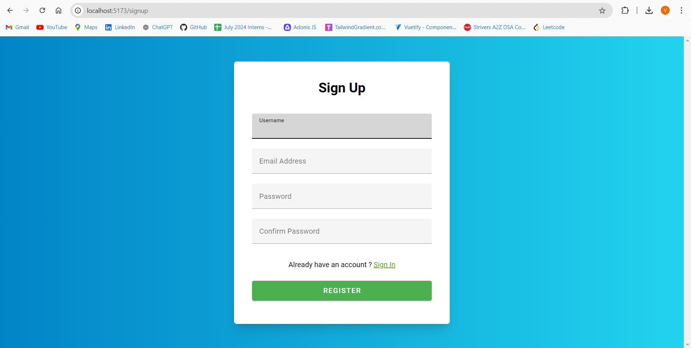
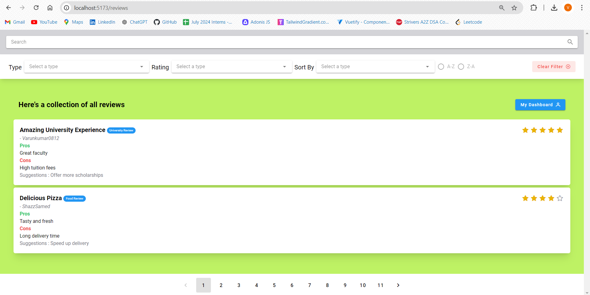
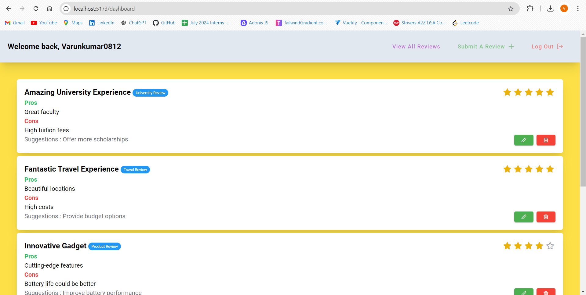
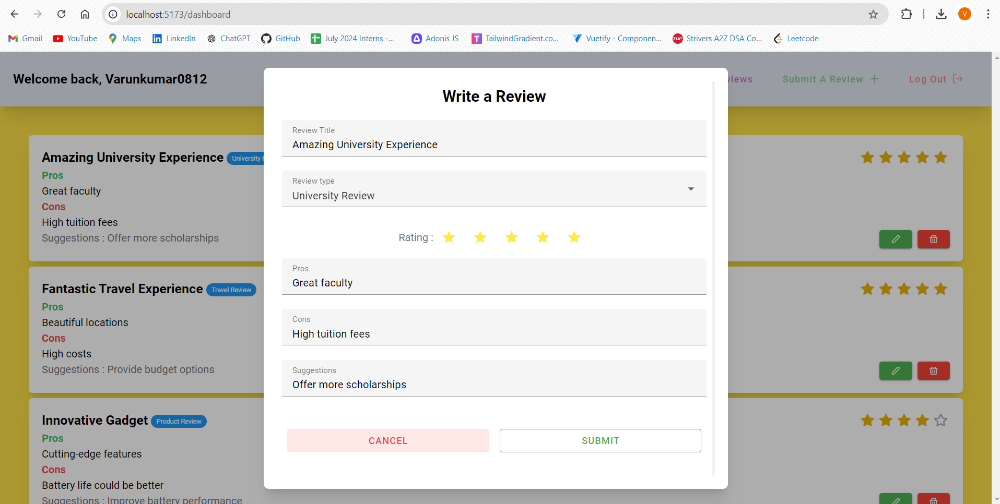

# Official Review Management System

## Project Overview

The Official Review Management System is a comprehensive platform designed to facilitate the management of formal reviews or evaluations. Built with AdonisJS for the backend and Vue.js for the frontend, the system provides a polished, user-friendly interface. It is highly adaptable for various use cases, such as employee performance reviews or academic evaluations.

## Key Features and Pages

- **Landing Page**:  
  Introduction to the system, directing users to sign in or register.

- **Sign In/Up Pages**:  
  User authentication with frontend validation and backend error messages.

- **Reviews Page**:  
  - Displays all reviews with pagination, search, and filter options.
  - Reviews are presented as cards showing details like stars, pros, and cons.

- **Dashboard Page**:  
  - Displays user-specific reviews without pagination.
  - Includes options to create new reviews, edit existing ones, delete reviews, and logout.
  - Modals are used for creating and editing reviews.

## Screenshots

Here are some screenshots of the Official Review Management System:

1. **Sign Up Page:**
   

2. **Reviews Page:**
   

3. **Dashboard Page:**
   

4. **Create/Edit Review Modal:**
   

## Styling and Components

- **Vuetify**:  
  Used for components like modals, alerts, cards, and text fields.

- **Tailwind CSS**:  
  Applied for consistent styling and layout across the application.

## Vue.js Key Concepts Used

- **Vue Router**:  
  For navigation between different pages like Reviews and Dashboard.

- **Lifecycle Hooks**:  
  Managing component lifecycle events.

- **Options API and Composition API**:  
  Structuring components and handling logic.

- **Directives**:  
  Adding dynamic behavior to elements.

- **Event Handling**:  
  Capturing and responding to user interactions.

- **Props Passing**:  
  Sharing data between components.

- **Provide and Inject**:  
  Sharing data across the component hierarchy.

- **Watch**:  
  Reacting to changes in data.

- **Computed Properties**:  
  Deriving values based on reactive data.

- **Pinia Stores**:  
  Managing global state.

- **Emit**:  
  Handling event communication between components.

## Technologies Used

- **Backend**: AdonisJS
- **Database**: MySQL
- **Frontend**: Vue.js, Vuetify, Tailwind CSS
- **State Management**: Pinia

## Backend Repository

For the backend implementation of this project using AdonisJS and MySQL, please visit the [Backend Repository](https://github.com/Varunkumar0812/rms-backend).
